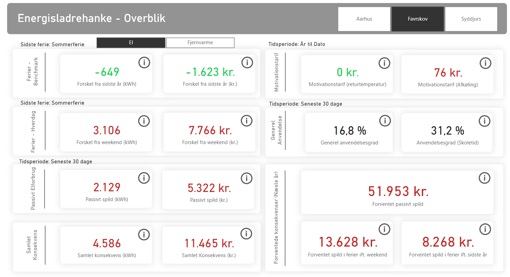

# Enformanten / GovTech Midtjylland - Smart M2

Enformanten is an energy saving tool for getting insights into energy usage (Distrinct Heating & Electricity) as well as analyzing room/booking usage on public schools/buildings. The project has developed two main parts: Analytics & AI.

# Analytics

The analytics part of the project has leveraged an existing platform built by NTT DATA to ingest, transform and visualize data in dashboards. This has resulted in an overall dashboard with pages for getting insights into several views on energy usage spanding from vacation closing of buildings to the usage of energy in passive hours. 

The main output is data pipelines, transformations and a Power Bi Report

# AI

Write something about the two models - Nicolai

