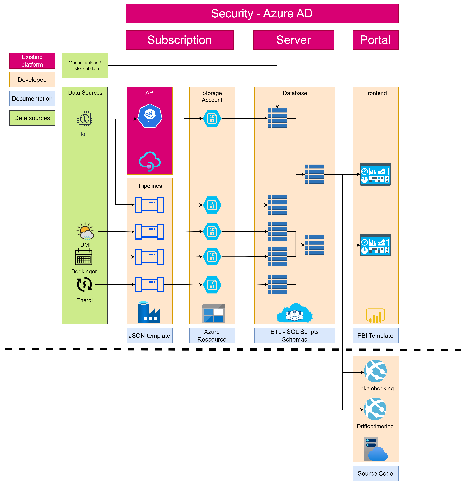

# Introduction

The analytics part of the project has tried to innovate on how the available data can be used to show insights on energy usage as well as providing guidance in optimizing this usage. The project has in broad terms setup the following functionalities:

* Dataload via *pipelines* or *APIs*
* *Storage* in raw format in Azure Storage Accounts and processed data in Snowflake DB
* *Transformations* via Snowflake SQL
* Dashboard and insights via *frontend* in Power Bi

# Architecture

The architecture has been built on a hybrid-approach by using an existing dataplatform provided by NTT DATA Business Solutions and furthermore developing specific functionalities such as transformations and analytics.

The architecture is therefore split into 2 parts:
* Existing dataplatform (Not open-soruced)
* Specific functionalities (Open-source)

In the below diagram an overview of the general architecture can be seen with the blue box telling how it is documented in this repo.

