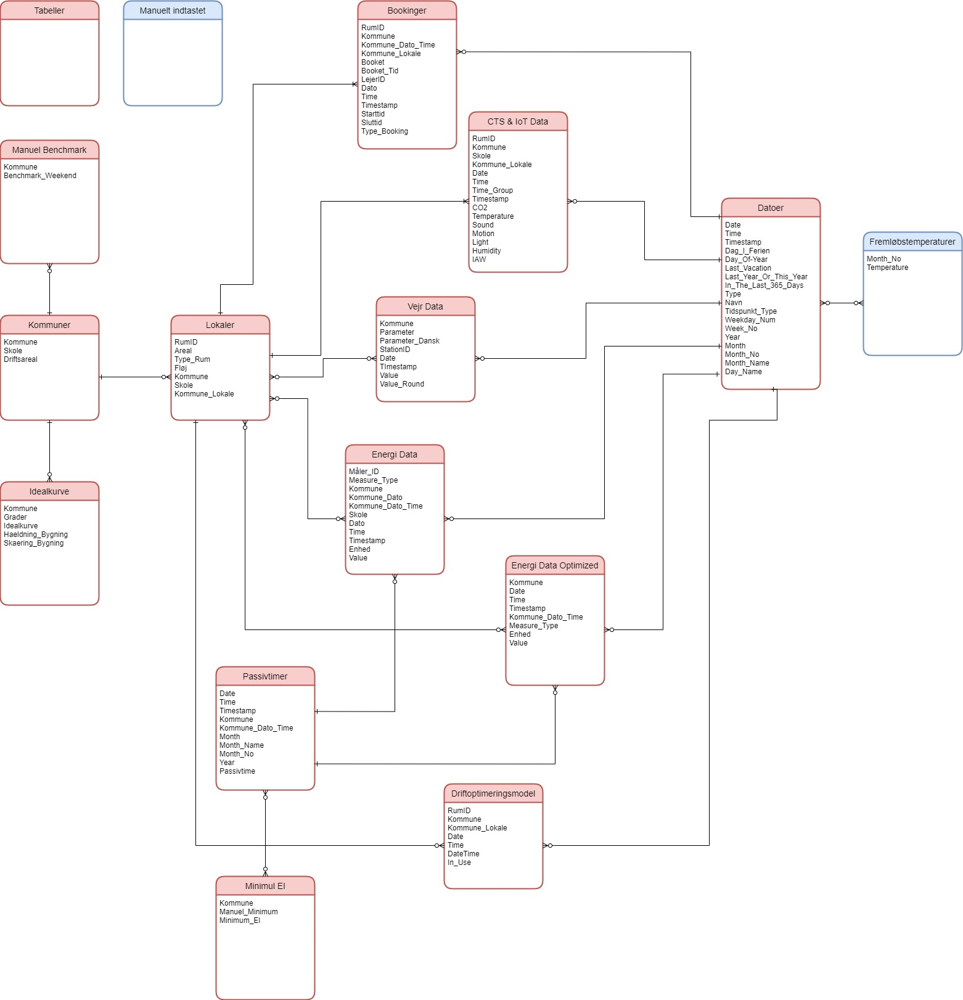

# Configuration

The frontend can be setup locally by downloading and using the template (.pbit)

## Setup
1. Download the Power Bi Template file
2. Import from template
3. Insert Snowflake Server link


## Prerequistes

* Snowflake Server
* Role: GOVTECH_DB_OWNER
* Warehouse: GOVTECH_ANALYST_WH
* The tables as they are setup in transformations

## Alternative to Snowflake

If you want to use another Database the snowflake, you need to change the data connections in Power Bi.

Go into Advanced Editor in Transform Data and change to another Database. 

Example:

``` m
let
    Source = Snowflake.Databases(Server,"GOVTECH_ANALYST_WH",[Role="GOVTECH_DB_OWNER"]),
    GOVTECH_DB_Database = Source{[Name="GOVTECH_DB",Kind="Database"]}[Data],
    RAW_Schema = GOVTECH_DB_Database{[Name="RAW",Kind="Schema"]}[Data],
    #"4_FEATURIZ_ENERGIDATA_Table" = RAW_Schema{[Name="4_FEATURIZ_ENERGIDATA",Kind="Table"]}[Data],
    #"Renamed Columns" = Table.RenameColumns(#"4_FEATURIZ_ENERGIDATA_Table",{{"VALUE::FLOAT", "VALUE"}})
in
    #"Renamed Columns"
```

# Datamodel



| Relationship Id | Left side                                   | Cardinality | Right side                                           |
| --------------- | ------------------------------------------- | ----------- | ---------------------------------------------------- | 
| 537             | '4_FEATURIZ_DATOER'[TIMESTAMP]              | 1   -->   M | '4_FEATURIZ_ENERGIDATA'[TIMESTAMP]                   |
| 538             | '4_FEATURIZ_DATOER'[TIMESTAMP]              | 1   -->   M | '4_FEATURIZ_DMI'[TIMESTAMP]                          |
| 539             | '4_FEATURIZ_LOKALER'[KOMMUNE]               | M   -->   M | '4_FEATURIZ_ENERGIDATA'[KOMMUNE]                     |
| 540             | '4_FEATURIZ_LOKALER'[KOMMUNE]               | M   -->   M | '4_FEATURIZ_DMI'[KOMMUNE]                            |
| 541             | '4_FEATURIZ_LOKALER'[KOMMUNE_LOKALE]        | 1   -->   M | '4_FEATURIZ_BOOKINGS_TIME'[KOMMUNE_LOKALE]           |
| 542             | '4_FEATURIZ_DATOER'[TIMESTAMP]              | 1   -->   M | '4_FEATURIZ_BOOKINGS_TIME'[TIMESTAMP]                |
| 543             | '4_FEATURIZ_DATOER'[TIMESTAMP]              | 1   -->   M | '4_FEATURIZ_CTS_X_IOT'[TIMESTAMP]                    |
| 544             | '4_FEATURIZ_LOKALER'[KOMMUNE_LOKALE]        | 1   -->   M | '4_FEATURIZ_CTS_X_IOT'[KOMMUNE_LOKALE]               |
| 545             | '4_FEATURIZ_LOKALER'[KOMMUNE_LOKALE]        | 1   -->   M | '4_FEATURIZ_DRIFTOPTIMERINGSMODEL'[KOMMUNE_LOKALE]   |
| 546             | '4_FEATURIZ_DATOER'[TIMESTAMP]              | 1   -->   M | '4_FEATURIZ_DRIFTOPTIMERINGSMODEL'[DATETIME]         |
| 547             | '4_FEATURIZ_PASSIVTIMER'[KOMMUNE_DATO_TIME] | 1   -->   M | '4_FEATURIZ_ENERGIDATA'[KOMMUNE_DATO_TIME]           |
| 548             | '1_RAW_KOMMUNER_SKOLER'[KOMMUNE]            | 1   -->   M | '4_FEATURIZ_LOKALER'[KOMMUNE]                        |
| 549             | '4_FEATURIZ_PASSIVTIMER'[KOMMUNE_DATO_TIME] | 1   -->   M | '4_FEATURIZ_ENERGIDATA_OPTIMIZED'[KOMMUNE_DATO_TIME] |
| 550             | '4_FEATURIZ_LOKALER'[KOMMUNE]               | M   -->   M | '4_FEATURIZ_ENERGIDATA_OPTIMIZED'[KOMMUNE]           |
| 551             | '4_FEATURIZ_DATOER'[TIMESTAMP]              | 1   -->   M | '4_FEATURIZ_ENERGIDATA_OPTIMIZED'[TIMESTAMP]         |
| 552             | '1_RAW_KOMMUNER_SKOLER'[KOMMUNE]            | 1   -->   M | '4_FEATURIZ_IDEALKURVE'[KOMMUNE]                     |
| 553             | '1_RAW_KOMMUNER_SKOLER'[KOMMUNE]            | 1   -->   M | '4_FEATURIZ_BENCHMARK_WEEKEND_MANUEL'[KOMMUNE]       |
| 554             | '4_FEATURIZ_DATOER'[MONTHNO]                | M   -->   M | 'Fremløbstemperaturer'[Månednr]                      |
| 555             | '4_FEATURIZ_PASSIVTIMER'[KOMMUNE]           | M   -->   M | '4_FEATURIZ_MINIMUM_EL'[KOMMUNE]                     |
|                 |                                             |             |                                                      |

# Pages

## Overview


## Energy Utilization

### Year

### Vacations

### Building Utilization

### Ideal Curve


## Vacation Closing

### Benchmark with last year

### Benchmark with weekend

### Benchmark with target


## Passive Energy Usage


## Return Temperature


## Cooling

## Room Utilization

### Booking utilization

### General utilization
