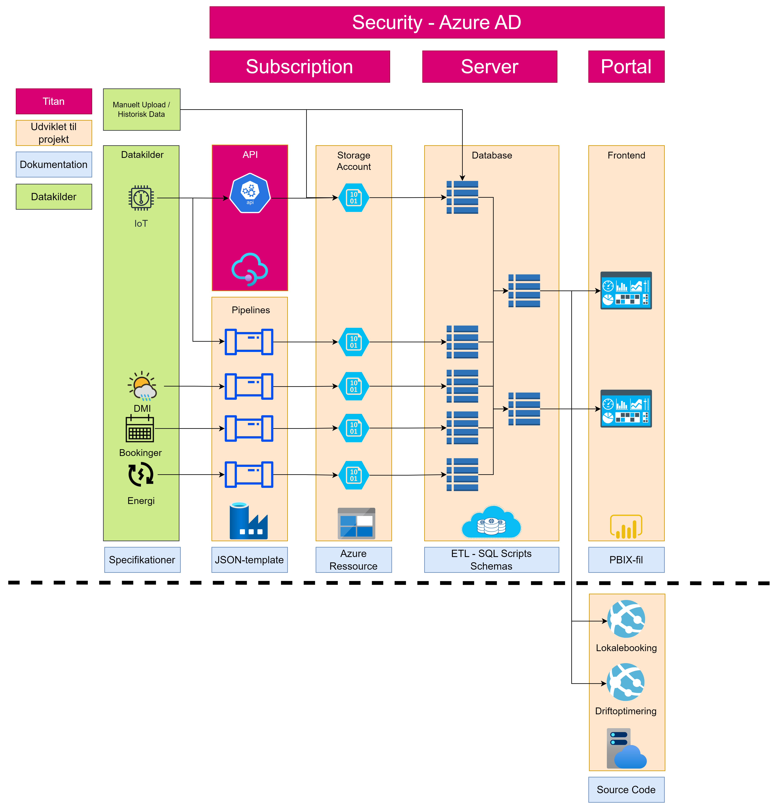

# Introduction

The analytics part of the project has setup the following functionalities:

* Dataload via *pipelines*
* *Storage* in raw format in Azure Storage Accounts and processed data in Snowflake DB
* *Transformations* via Snowflake SQL
* Dashboard and insights via *frontend* in Power Bi

# Architecture

The architecture has been built on a hybrid-approach by using an existing dataplatform provided by NTT DATA Business Solutions and furthermore developing specific functionalities such as transformations and analytics.

The architecture is therefore split into 2 parts:
* Existing dataplatform (Not open-soruced)
* Specific functionalities (Open source)

In the below diagram an overview of the general architecture can be seen.

