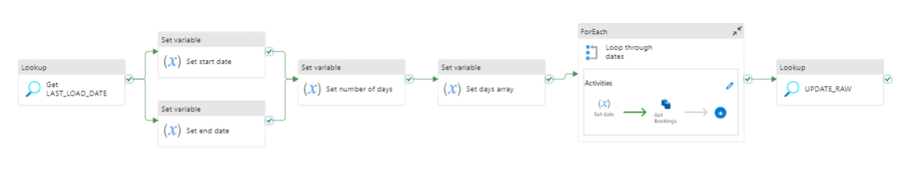

# Pipeline

The following pipeline have been setup in Azure Data Factory:



# Config
The bookings pipeline needs 3 linked services setup. An example with Favrskov's pipeline is shown below:


```json
"requires": {
        "linkedservices": {
            "LS_BLOB": {
                "supportTypes": [
                    "AzureBlobStorage"
                ]
            },
            "LS_SNOWFLAKE": {
                "supportTypes": [
                    "Snowflake"
                ]
            },
            "LS_FAVRSKOV_BOOKING_API": {
                "supportTypes": [
                    "RestService"
                ]
            }
        }
    }
```


