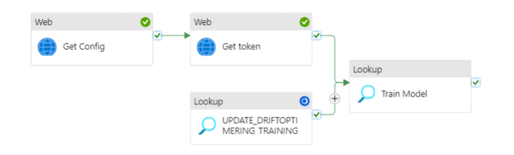

# Pipeline

The AI-model is activated by two different endpoints. The first is the training, that is orchestrated from this pipeline.
This pipelines is therefore responsible for training the AI-model "Driftoptimeringsmodel" once a month. 



The prediction are done during runtime in the master pipeline.

# Config

The pipelines needs an endpoint for the model as well as connection to a database/snowflake:

``` json
"requires": {
        "linkedservices": {
            "LS_Driftoptimeringsmodel": {
                "supportTypes": [
                    "HttpServer"
                ]
            },
            "LS_SNOWFLAKE": {
                "supportTypes": [
                    "Snowflake"
                ]
            }
        }
    }
```
