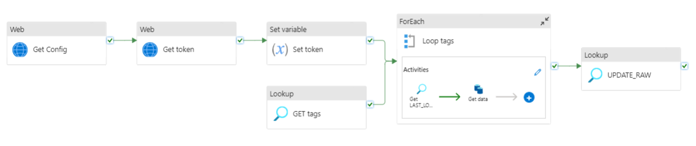
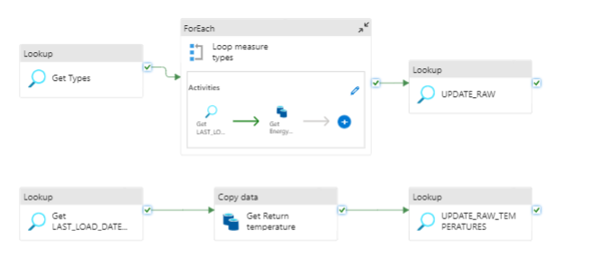

# Pipeline

This pipeline is responsible for gathering energy consumption. Firstly it fetches the credentials/config for getting an access token for the API. The token is then fetched and stored in a variable. The wanted tags are then fetched from a config and looped through. In the loop the last load date from the databased is looked up and the API is then called to get  and save the newest data. Finally the raw table in the database is triggered to update. 



For Aarhus the return temperatures and Energy consumption are on two different endpoints:


# Config
The energy pipeline needs 3 linked services setup. An example with Favrskov's pipeline is shown below:


```json
 "requires": {
        "linkedservices": {
            "LS_BLOB": {
                "supportTypes": [
                    "AzureBlobStorage"
                ]
            },
            "LS_SNOWFLAKE": {
                "supportTypes": [
                    "Snowflake"
                ]
            },
            "LS_ENERGI_FAVRSKOV": {
                "supportTypes": [
                    "RestService"
                ]
            }
        }
    }
```


