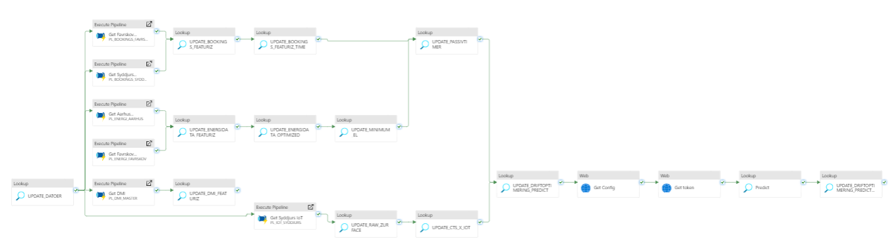

# Pipeline

This pipeline is the main pipeline and orchestrator for the collection and storing of new data.

It firstly updates the date table in datebase to always contain dates until today. Then it calls all the individual pipelines for fetching data. It then runs a number of stored procedures to update the persisted tables that are being used for e.g., BI/Frontend. 

Finally it runs the AI-model for predicting room usage before also updating that persisted table of output from the model.



# Config
The pipeline requires all the needed configuration of linked services:

``` json
    "requires": {
        "linkedservices": {
            "LS_BLOB": {
                "supportTypes": [
                    "AzureBlobStorage"
                ]
            },
            "LS_SNOWFLAKE": {
                "supportTypes": [
                    "Snowflake"
                ]
            },
            "LS_Driftoptimeringsmodel": {
                "supportTypes": [
                    "HttpServer"
                ]
            },
            "LS_BOOKINGS_SYDDJURS": {
                "supportTypes": [
                    "RestService"
                ]
            },
            "LS_ENERGI_AARHUS": {
                "supportTypes": [
                    "RestService"
                ]
            },
            "LS_IOT_SYDDJURS": {
                "supportTypes": [
                    "RestService"
                ]
            },
            "LS_FAVRSKOV_BOOKING_API": {
                "supportTypes": [
                    "RestService"
                ]
            },
            "LS_ENERGI_FAVRSKOV2": {
                "supportTypes": [
                    "RestService"
                ]
            },
            "LS_DMI": {
                "supportTypes": [
                    "RestService"
                ]
            }
        }
    }
```