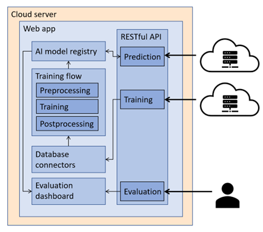

# AI Room Utilization Model
The AI Room Utilization Model (Tilly) (Formally, Driftsoptimeringsmodellen in Danish) uses Artificial Intelligence (AI) to detect whether a given room has been in use or not, based on IoT sensor data. The software solution behind the model is intended to be deployed as a cloud-based web application, accessible to an ETL data flow through an OAuth2-protected RESTful FastAPI engine. The figure below shows the overall architecture of the solution.

As evident from the figure above, the solution has multiple components even though the name suggests it's solely an AI model. These components are covered in the following section. Tilly integrates with Enformanten's data flow and the associated (Snowflake) database but is otherwise closed to traffic.

## Data Foundation
From Enformanten's general data flow, Tilly receives a series of variables for each time unit (i.e., 15-minute intervals) for each room. The variable definitions are shown below.

|Variable Name|Description|Data Type|
|:------------|:----------|:--------|
|ID           |Local ID   |Integer  |
|KOMMUNE      |Associated Municipality|String|
|SKOLE        |Associated School|String|
|DATE         |Date for the time interval|String|
|TIME         |Time for the time interval|String|
|DAYNAME      |e.g., Monday, Tuesday|String|
|TIDSPUNKT_TYPE|e.g., School time or free time|String|
|SKEMALAGT    |Whether the time interval appears in the school schedule|Boolean|
|TYPE         |Type of day, e.g., Public holiday, special day, school vacation|String|
|NAVN         |Specific calendar day, e.g., Christmas holiday, summer vacation or Ascension Day|String|
|CO2          |CO2 level measured in the given time interval|Float|
|TEMP         |Temperature measured in the given time interval|Float|
|MOTION       |Number of movements detected in the given time interval|Float|
|IAQ          |Indoor Air Quality value measured in the given time interval|Float|
|BOOKET       |Whether a booking is registered in the time interval|Boolean|

By end of the development, only CO2 is included in the actual training of the model among the sensor variables (CO2, temperature, movement, and IAQ). This is partly due to inconsistent data quality for the remaining variables and partly due to iterative experimentation, where the aggregate performance of AI models has been evaluated by training on different combinations of the given sensor variables. This is further elaborated in the technical documentation of the solution. However, the architecture is designed for combinability, meaning that future development will be able to incorporate the remaining variables without major changes. For the same reason, Enformant's data flow is set up to deliver all existing sensor data to the Operational Optimization Model.

## Components
As mentioned earlier, the Operational Optimization Model contains multiple components. With the exception of the dashboard used for evaluation, these components are essential for the chosen architecture.

### Model Registry
Because the utilization rate is desired to be detected for each room, across schools, a separate AI model is trained per room. This results in 100+ AI models that are collectively trained on over 9 million variables. This number of models makes it necessary to create a model registry to systematically access and apply each model in the correct context. Here, a non-relational in-memory data structure is used in which each room, for each school, is indexed under a unique ID, derived from the school and the room's name.

### Preprocessing
To train the models on the received data, extensive preprocessing is required. Preprocessing can be divided into two categories: Cleaning and Augmentation. Each subprocess in these categories is detailed below, where 1 – 5 are data cleaning and 6 – 7 are data augmentation.

#### 1. Heuristic Estimation of Utilization Rate
To prepare the data for the AI models, the first step is to estimate the utilization rate for each room based on booked and planned time periods. The exact process for this is described in the technical documentation of the solution. This process provides prior knowledge for the AI models, which in advance adjust their expected level of utilization for a given room over time. Therefore, we use a heuristic method to create an informed basis for the model's predictions.

Heuristic Estimation of Utilization Rate for Room Utilization
In the business context of room scheduling and occupancy optimization, one of the most crucial preprocessing steps for training AI models is estimating the utilization rate of each room. This is the first step in a two-category preprocessing pipeline, which also includes Data Cleaning and Data Augmentation.

Parameters and Heuristics
Utilization Coefficient: A scaling factor used to fine-tune the estimated usage rate. Its default value is set at 2.1.

Minimum Utilization Bound: A heuristic lower limit set to ensure that the estimated usage of a room doesn't fall below this value, typically set at 0.1.

Maximum Utilization Bound: A heuristic upper limit set to ensure that the estimated usage of a room doesn't exceed this value, typically set at 0.4.

Methodology
The algorithm calculates the number of slots that are in use, which include times marked as either "Booked" or "Scheduled" according to the organizational schema. This count of used slots is then adjusted to ensure it doesn't fall below the predefined minimum utilization bound.

The net estimated utilization 

Exception Cases
If the algorithm encounters a situation where there are zero total slots, it returns a predefined fallback value, denoted as "auto," to indicate that the utilization could not be computed.

Business Implications
This heuristic estimation serves as an informative prior for AI models aiming to predict room utilization. The model adjusts its expectations based on this heuristic, improving the overall accuracy and reliability of future predictions. This is especially valuable for optimizing room bookings and schedules, thereby leading to more efficient use of organizational resources.

\( a^2 + b^2 = c^2 \)

When calculating the estimated usage \( U \) for a given room, the formula used is:

U = \min \left( \frac{{\text{Used Slots} \times \text{Usage Coefficient}}}{{\text{Total Slots}}}, \text{Max Usage} \right)
    
    where: 
    \( \text{Used Slots} \) = Number of slots that are in use, which include times marked as either "Booked" or "Scheduled" according to the organizational schema.
    \( \text{Usage Coefficient} \) = A scaling factor used to fine-tune the estimated usage rate. Its default value is set at 2.1.
    \( \text{Total Slots} \) = Total number of slots in the given time period.
    \( \text{Max Usage} \) = A heuristic upper limit set to ensure that the estimated usage of a room doesn't exceed this value, typically set at 0.4.
    

