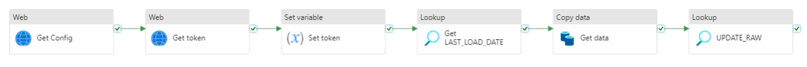

# Pipeline

This pipeline fetches IoT Data from Syddjurs. It firstly gathers the config for the credentials to fetch an access token. After the token is obtained it looks up the last load date of IoT Data. It the proceeds to call the API for IoT Data from the last load date until today. Finally it updates the raw table in the database



# Config

The IoT pipeline needs 3 linked services setup. An example with Favrskov's pipeline is shown below:


```json
"requires": {
        "linkedservices": {
            "LS_SNOWFLAKE": {
                "supportTypes": [
                    "Snowflake"
                ]
            },
            "LS_IOT_SYDDJURS": {
                "supportTypes": [
                    "RestService"
                ]
            },
            "LS_BLOB": {
                "supportTypes": [
                    "AzureBlobStorage"
                ]
            }
        }
    }
```