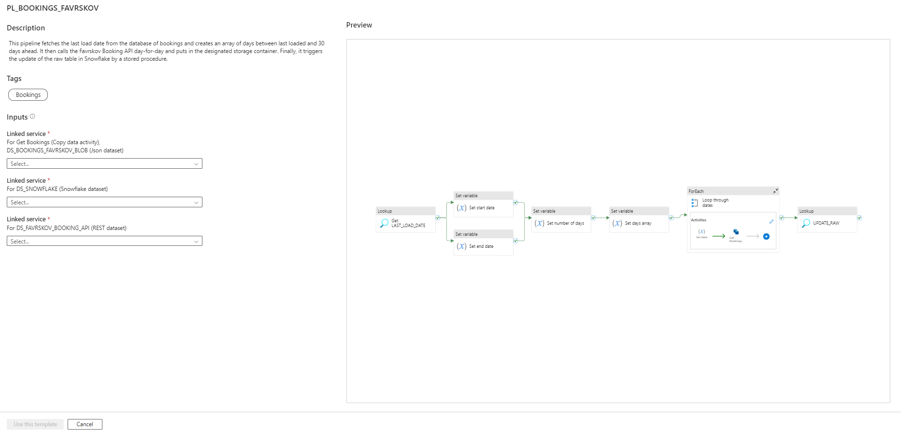

# Azure Data Factory

The pipelines for fetching and storing data as well as orchestrating the load and persisting of both raw data as well as featurized tabels used for reportin are all built in Azure Data Factory.

In the folders the individual pipelines for each datasource are put. The master pipeline for orchistrating and updating data are organized in the Master-folder.

# Setup

If setup is wanted on a seperate instace of ADF it is needed to:

1. Download the folder of the needed pipeline
2. Zip it
3. Create new pipeline --> Import from template
4. Attach the needed Linked Services as they are described

The UI for using a template:

# Output / Storage

All the pipelines are sending their raw files in the *Copy* activites to a set Storage Account. All updates of raw and featurized tables are setup in a Snowflake Instance. This can be switched to any Database that are ADF-compatiable. 

# Security

All API-keys, credentials etc. are stored in an Azure Key Vault.

