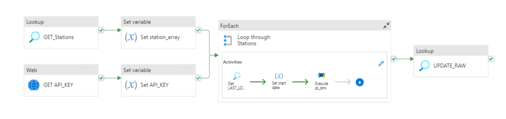
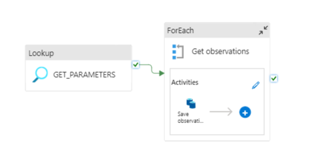

# Pipeline
This pipeline fetches the wanted stations from the municipalities from the config-file and saves them in an array. It also fetches the API-key from the Azure Keyvault.

It then loops through all stations, gets the last load date and executes the pipelines fetching and saving the observations. Finally, it updates the raw table in the database by a stored procedure. 

The loop in "PL_DMI_MASTER" starts a sub-pipeline "PL_DMI" that fetched the wanted parameters from a config a fetches the latest data

API: https://confluence.govcloud.dk/display/FDAPI/Meteorological+Observation+Data

## Master


## Sub-pipeline



# Config

```json
 "requires": {
        "linkedservices": {
            "LS_BLOB": {
                "supportTypes": [
                    "AzureBlobStorage"
                ]
            },
            "LS_SNOWFLAKE": {
                "supportTypes": [
                    "Snowflake"
                ]
            },
            "LS_DMI": {
                "supportTypes": [
                    "RestService"
                ]
            }
        }
    }

```